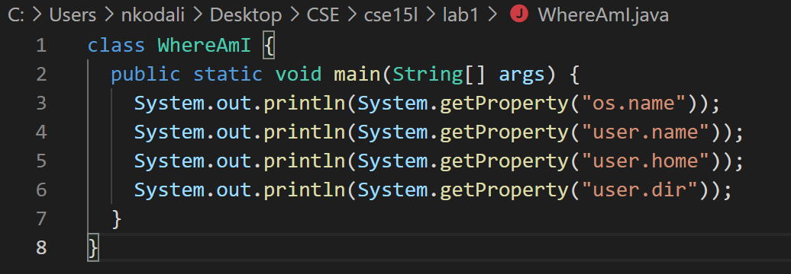

# Lab Report 1 Week 2

## Topic: Remote Access
How to access the `ieng6` servers remotely.
---
---
### Step 1: Install VScode
* Go to [ https://code.visualstudio.com/]( https://code.visualstudio.com/) and hit the top right **Download** button.


---
* Choose the OS you are using


---
* Set up and open VScode. Should look like this.


---
---
### Step 2: Remotely Connecting
* [Install OpenSSH](https://docs.microsoft.com/en-us/windows-server/administration/openssh/openssh_install_firstuse) and find your [student account information](https://sdacs.ucsd.edu/~icc/index.php).

* Open a new terminal and type the following command, but rpelace the `zz` with your account specific sequence.
```
$ ssh cs15lwi22zz@ieng6.ucsd.edu
```

* It will display `Are you sure you want to continue connecting (yes/no/[fingerprint])?`. Just type `yes`.
Then, it will prompt you for your `Password: `. Type in your password (it wont display anything as you are typing it).
The outcome should look like this.


---
---
### Step 3: Trying Some Commands
* `cd ~` to go to the home directory, `cd` to change directroy to whichever you want.

* `ls` to list all fiels in directory, `ls -l` is to long list information about files. `ls -a` is to show hidden files. `ls <directory>` to show files in a specific accounts directory.


* Ctrl - D or `exit` to logout.

---
### Step 4: Moving Files With `scp`
* Create a file and save it on your client folder.



* Type `scp file.java cs15lwi22zz@ieng6.ucsd.edu:~/` but replace `file.java` with the file you want to send to the server and `zz` with your own letter sequence. 

* Then type `ls` to verify if the file has successfully been saved on server. 


---
---
### Step 5: Setting an `SSH` Key
* Type the command `ssh keygen`. This should generate a key to access ssh without a password. It will ask for passphrase and finger print. You can just hit Enter key on those. Then you will get a random art image.

* If on windows you have to follow additional steps from [Microsoft](https://docs.microsoft.com/en-us/windows-server/administration/openssh/openssh_keymanagement#user-key-generation).

* Then you need to copy the public key generated in the SSH server. So log into server and `mkdir ssh` and then logout. Then `scp` the location of the file to the server by using the command `scp /Users/username/.ssh/id_rsa.pub cs15lwi22@ieng6.ucsd.edu:~/.ssh/authorized_keys'

* When you log in it should look like this:


---
---
### Step 6: Optimizing Remote Running
* You can run multiply commands on the same line by using semi-colons to distiguish them.

```
javac file.java; java file
```

* You can use the arrow keys to retry compiling and interpret the same file.

* Finally, you can use the code below to log in, show file directories, and log out.
```
ssh cs15lwi22@ieng6.ucsd.edu "ls"
```


*Keystroke" To run the command above I used 2 keystrokes. I hit the up arrow to get the `ssh cs15lwi22atv@ieng6.ucsd.edu` command and enter key to run the command. 
`"ls"` could also be replaced with other commands such as `scp` etc.
