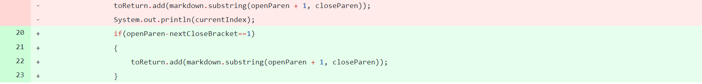
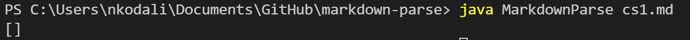
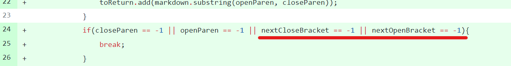
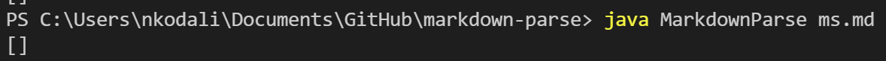
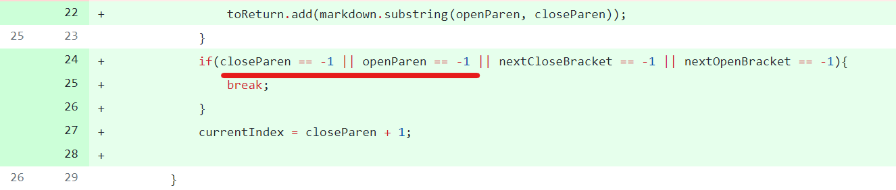
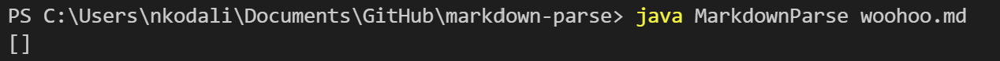

# Lab Report 2 Week 4

## Topic: Testing an debugging
Incremental Programming and Debugging

---

### Example 1: cs1.md
cs1.md is a file that has a bunch of spaces in between the [] and ():
[cs1.md](https://github.com/sos-nandita/markdown-parse/blob/main/cs1.md)

Code changes:

We made sure that when the program looks in between the () & [] the gap is only 1 index. So when the program sees a bunch of spaces in between the two characters, it returns an empty link. 

Output when run:

---

### Example 2: ms.md
ms.md is a file that has () but no []:
[ms.md](https://github.com/sos-nandita/markdown-parse/blob/main/ms.md)

Code changes:

In this program, we had to make sure that the bugs lack of [] was read. As a result, we initially made it exit the loop if those brackets weren't found. I forgot to commit changes when we just had brackets (oops) but it was the tow underlined commands in the if statement.

Output when run: 

---

### Example 2: woohoo.md
ms.md is a file that has [] but no ():
[woohoo.md](https://github.com/sos-nandita/markdown-parse/blob/main/woohoo.md)

Code changes:

In this program, we had to make sure that the bugs lack of () was read. As a result, we initially made it exit the loop if those parenthesis weren't found. As a result, we made sure all [] and () were found in order for the code to exectue properly. 

Output when run:

