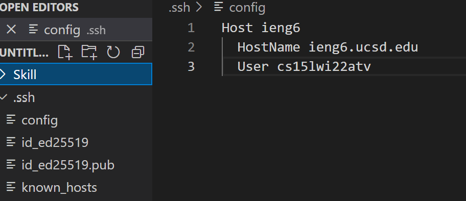
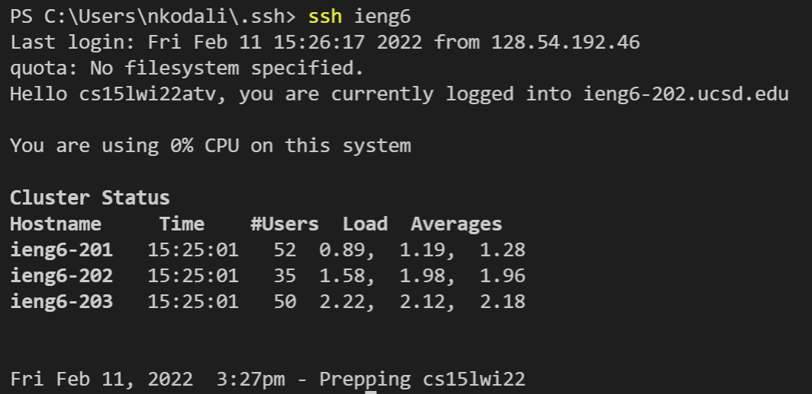

# Lab report 3

## Topic: Streamlining `ssh` configuration

---

### Step 1: `ssh` config

Create a config file in the `.ssh` folder and paste the following code.

```
Host <alias>
  HostName ieng6.ucsd.edu
  User cs15lwi22zzz     --> zzz should be replaced by your username
  IdentityFile <Path to the private key part of the key pair used for this ssh port> --> Optional
```


---

### Step 2: Using `ssh` with your alias.

Now to login, you can type `ssh <alias>` instead of `ssh cs15lwi22zzz@ieng6.ucsd.edu`

Logging in should look like this:



---

### Step 3: `scp` files

We can now use:

```
$ scp <transfer_file> <your_alias>:~/
```

Instead of:

```
$ scp <transfer_file> cs15lwi22zzz@ieng6.ucsd.edu:~/
```


