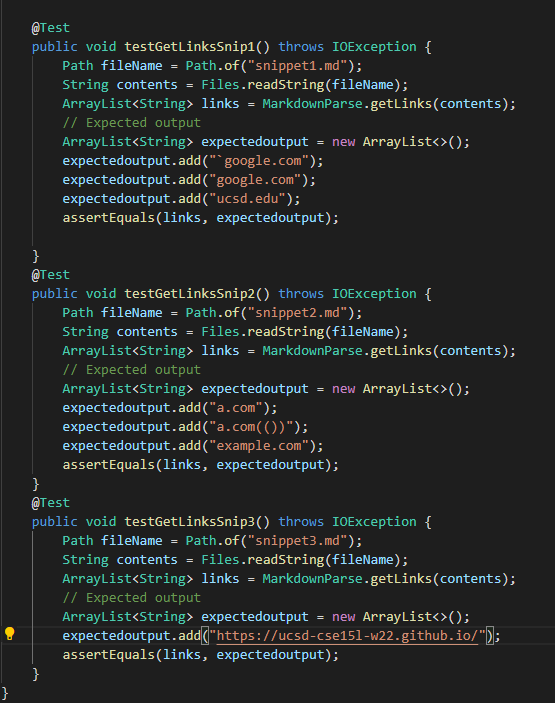
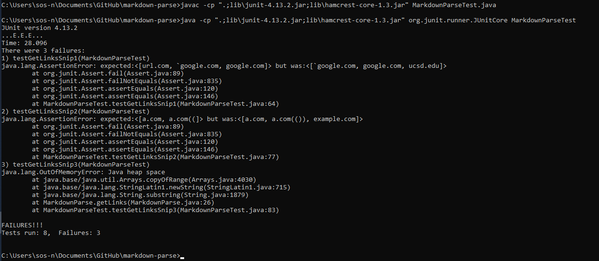
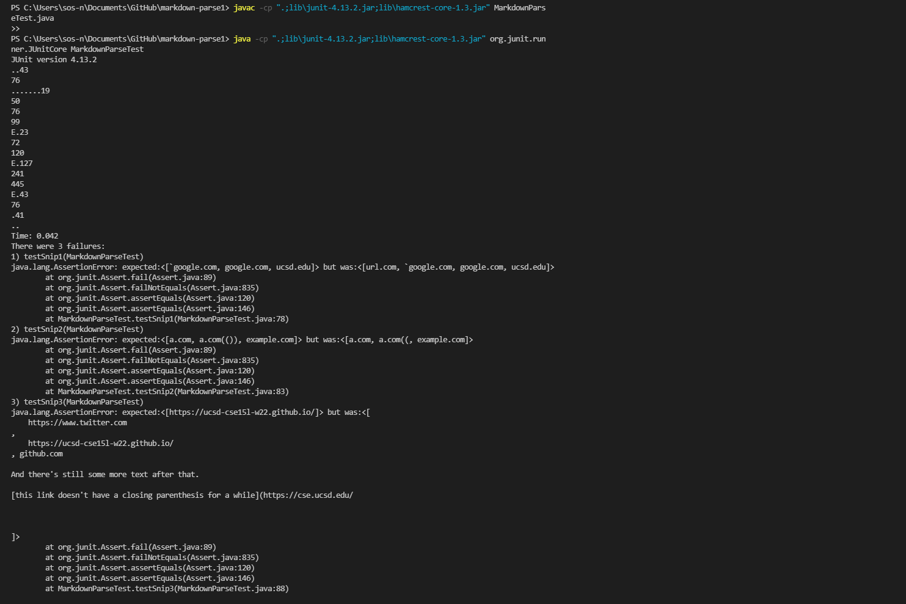
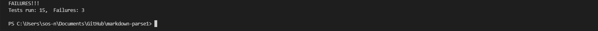

# Lab report 4

## Topic: Markdown Snippets 

---

### Repository links
[My repository](https://github.com/sos-nandita/markdown-parse) \
[Reviewed repository](https://github.com/Darrengn/markdown-parse)

---
### Snippets

## 1

```
`[a link`](url.com)

[another link](`google.com)`

[`cod[e`](google.com)

[`code]`](ucsd.edu)
```

## 2

```
[a [nested link](a.com)](b.com)

[a nested parenthesized url](a.com(()))

[some escaped \[ brackets \]](example.com)
```

## 3

```
[this title text is really long and takes up more than 
one line

and has some line breaks](
    https://www.twitter.com
)

[this title text is really long and takes up more than 
one line](
    https://ucsd-cse15l-w22.github.io/
)


[this link doesn't have a closing parenthesis](github.com

And there's still some more text after that.

[this link doesn't have a closing parenthesis for a while](https://cse.ucsd.edu/


)

And then there's more text
```

## Tests added in my repository



## Output



## Peer Output

 \
 

## Questions

*Do you think there is a small (<10 lines) code change that will make your program work for snippet 1 and all related cases that use inline code with backticks? If yes, describe the code change. If not, describe why it would be a more involved change.*

I don't think it is necessary to include so many lines of code to make the code work for snippet one. I think that in MarkdownParse. java, just adding another if statement that checks for backticks or an if statement that checks if there is ANY symbol in given locations is present. 

---

*Do you think there is a small (<10 lines) code change that will make your program work for snippet 2 and all related cases that nest parentheses, brackets, and escaped brackets? If yes, describe the code change. If not, describe why it would be a more involved change.*

I feel like this code change would be much lenghtier than the previous becuase we are checking for specifc characters and whether they exist or not. So adding in a series of if statements could possibly work. 

---

*Do you think there is a small (<10 lines) code change that will make your program work for snippet 3 and all related cases that have newlines in brackets and parentheses? If yes, describe the code change. If not, describe why it would be a more involved change.*

I feel like there will be a lot of iterative coding that needs to be done to fix this issue. Checking for so many characters without and end character is quite difficult. IUt would be very diffciult for the code to reach an end point. But maybe making the end char sequence ".com" coudl potentially work (though that is only for one scenario and can easily be failed once again).
