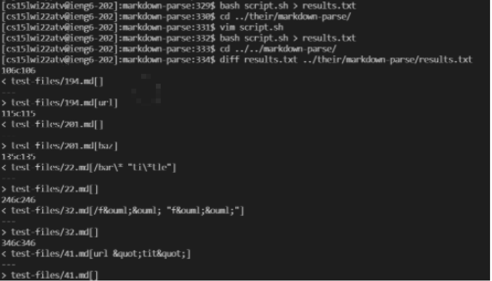
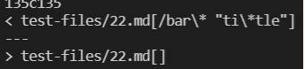
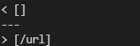
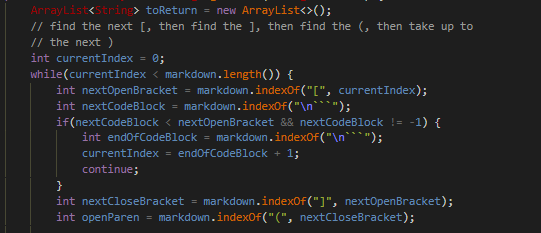

### Lab report 5: Commonmark-spec

In this lab report, I am going to show *two* different tests that gave different outputs than that of our implementation.

## Explain
- *How you found the tests with different results (Did you use diff on the results of running a bash for loop? Did you search through manually? Did you use some other programmatic idea?)*

In our lab, we used the command below to compare the given tests. 

'''
` $ diff results.txt ../their/markdown-parse/results.txt`
'''

In implementation:


## 22.md

The file contains the following:

```

[foo](/bar\* "ti\*tle")

```

The results after running the command were:



As we can see, mark-down parse returned the value `[/bar\* "ti\*tle"]` whereas the given implementaion returned `[]`

My code:
```
public static ArrayList<String> getLinks(String markdown) {
        ArrayList<String> toReturn = new ArrayList<>();
        // find the next [, then find the ], then find the (, then take up to
        // the next )
        int currentIndex = 0;
        if(markdown.indexOf("(")!=-1 && markdown.indexOf("[")!=-1)
            {
             while(currentIndex < markdown.length()) {
                if(markdown.indexOf("!")==0)
                {
                    break;
                }
                int nextOpenBracket = markdown.indexOf("[", currentIndex);
                int nextCloseBracket = markdown.indexOf("]", nextOpenBracket);
                int openParen = markdown.indexOf("(", nextCloseBracket);
                int closeParen = markdown.indexOf(")", openParen);
                if(openParen-nextCloseBracket==1)
                {
                    toReturn.add(markdown.substring(openParen + 1, closeParen));
                }
                currentIndex = closeParen + 1;
            }
        }
        return toReturn;
    }
   ```
   
   It doesn't take into consideration the given test and their symbols. As a result, it went into the while loop and ran the process of creating the link. 
   
---

## 573.md

The file contains the following:
```

](/url2)

```

The results after running the commands were:



As we can see, mark-down parse returned the value `[]` whereas the given implementaion returned `[/url]`

Prof. code: 



It doesn't take into consideration the image links. As a result, it went into the while loop and ran the process of creating the link. Instead, if there was an if statement that included checking for a `!` at the first index, it wouldn't run into the while loop.

